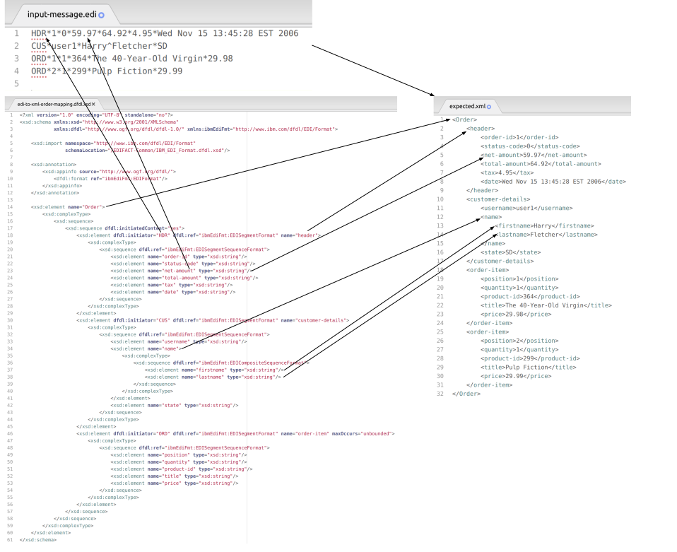

== Smooks EDI Cartridge

image:https://img.shields.io/maven-central/v/org.smooks.cartridges.edi/smooks-edi-cartridge[Maven Central]
image:https://img.shields.io/nexus/s/org.smooks.cartridges.edi/smooks-edi-cartridge?server=https%3A%2F%2Foss.sonatype.org[Sonatype Nexus (Snapshots)]
image:https://github.com/smooks/smooks-edi-cartridge/workflows/CI/badge.svg[Build Status]

// tag::smooks-edi-cartridge[]
The EDI cartridge provides a reader for parsing EDI documents, and a visitor for serialising the event stream into EDI.

In the following pass-through configuration, Smooks parses an EDI document and then serialises, or unparses in DFDL lingo, the generated event stream to produce an EDI document identical to the parsed document.

.smooks-config.xml
[source,xml]
----
<?xml version="1.0"?>  
<smooks-resource-list xmlns="https://www.smooks.org/xsd/smooks-2.0.xsd"
                      xmlns:edi="https://www.smooks.org/xsd/smooks/edi-2.0.xsd">    

    <!-- Configure the reader to parse the EDI stream into a stream of SAX events. -->  
    <edi:parser schemaURI="/edi-to-xml-mapping.dfdl.xsd" // <1>
                segmentTerminator="%NL;" // <2>
                compositeDataElementSeparator="^"/> // <3>

    <!-- Configure the writer to serialise the XML stream into EDI. -->  
    <edi:unparser schemaURI="/edi-to-xml-mapping.dfdl.xsd" // <1>
                  segmentTerminator="%NL;" // <2>
                  compositeDataElementSeparator="^" // <3>
                  unparseOnNode="/Order"/> // <4>

</smooks-resource-list>
----

Config attributes common to the parser and unparser resources are:

. _schemaURI_: the DFDL schema describing the structure of the EDI document to be parser or unparsed. 
. _segmentTerminator_: the terminator for groups of related data elements. DFDL interprets _%NL;_ as a newline. 
. _compositeDataElementSeparator_: the delimiter for compound data elements.

The `+unparseOnNode+` attribute is exclusive to the unparser visitor. It tells the unparser which event to intercept and serialise. Consult  with the EDI cartridge's link:/xsd/smooks/edi-2.0.xsd[XSD documentation] for the complete list of config attributes and elements.

=== EDI DFDL Schema

The user-defined DFDL schema supplied to the _parser_ and _unparser_ config elements  drives the event mapping, whether it is EDI to SAX or SAX to EDI. This schema must import the bundled _IBM_EDI_Format.dfdl.xsd_ DFDL schema which defines common EDI constructs like segments and data elements.

The following figure illustrates the mapping process:

* _input-message.edi_ is the input/output EDI document.
* _edi-to-xml-order-mapping.dfdl.xsd_ describes the EDI to SAX, or SAX to EDI, event mapping.
* _expected.xml_ is the result event stream from applying the mapping.

==== Segments

The next snippet shows a segment declaration in DFDL:

[source,xml]
----
<?xml version="1.0" encoding="UTF-8" standalone="no"?>
<xsd:schema xmlns:xsd="http://www.w3.org/2001/XMLSchema"
            xmlns:dfdl="http://www.ogf.org/dfdl/dfdl-1.0/"
            xmlns:ibmEdiFmt="http://www.ibm.com/dfdl/EDI/Format">

    <xsd:import namespace="http://www.ibm.com/dfdl/EDI/Format" schemaLocation="/EDIFACT-Common/IBM_EDI_Format.dfdl.xsd"/>

    <xsd:annotation>
        <xsd:appinfo source="http://www.ogf.org/dfdl/">
            <dfdl:format ref="ibmEdiFmt:EDIFormat"/>
        </xsd:appinfo>
    </xsd:annotation>

    <xsd:element dfdl:initiator="HDR" // <1>
                 name="header" // <2>
                 dfdl:ref="ibmEdiFmt:EDISegmentFormat"> // <3>
        <xsd:complexType>
            ...
        </xsd:complexType>
    </xsd:element>
</xsd:schema>
----
<1> _dfdl:initiator_ identifies the segment code .
<2> _name_ attribute specifies the segment's XML mapping. 
<3> _ibmEdiFmt:EDISegmentFormat_ holds the segment structure definition; it is important to reference it from within the _dfdl:ref_ attribute.

===== Segment Cardinality

What is not demonstrated in the previous section is the segment element's optional attributes _minOccurs_ and _maxOccurs_ (default value of 1 in both cases). These attributes can be used to control the optional and required characteristics of a segment. An _unbounded_ maxOccurs indicates that the segment can repeat any number of times in that location of the EDI document.

===== Segment Groups

You implicitly create segment groups when:

. Setting the "maxOccurs" in a segment element to more than one, and
. Adding within the segment element other segment elements

The _HDR_ segment in the next example is a segment group because it is unbounded, and it encloses the _CUS_ and _ORD_ segments:

[source,xml]
----
<?xml version="1.0" encoding="UTF-8" standalone="no"?>
<xsd:schema xmlns:xsd="http://www.w3.org/2001/XMLSchema"
            xmlns:dfdl="http://www.ogf.org/dfdl/dfdl-1.0/"
            xmlns:ibmEdiFmt="http://www.ibm.com/dfdl/EDI/Format">

    <xsd:import namespace="http://www.ibm.com/dfdl/EDI/Format" schemaLocation="/EDIFACT-Common/IBM_EDI_Format.dfdl.xsd"/>

    <xsd:annotation>
        <xsd:appinfo source="http://www.ogf.org/dfdl/">
            <dfdl:format ref="ibmEdiFmt:EDIFormat"/>
        </xsd:appinfo>
    </xsd:annotation>

    <xsd:element dfdl:initiator="HDR" name="order" maxOccurs="unbounded">
        <xsd:complexType>
            <xsd:sequence>
                <xsd:sequence dfdl:ref="ibmEdiFmt:EDISegmentFormat">
                    ...
                </xsd:sequence>
                <xsd:element dfdl:initiator="CUS" dfdl:ref="ibmEdiFmt:EDISegmentFormat" name="customer-details">
                    <xsd:complexType>
                        ...
                    </xsd:complexType>
                </xsd:element>
                <xsd:element dfdl:initiator="ORD" dfdl:ref="ibmEdiFmt:EDISegmentFormat" name="order-item"
                             maxOccurs="unbounded">
                    <xsd:complexType>
                        ...
                    </xsd:complexType>
                </xsd:element>
            </xsd:sequence>
        </xsd:complexType>
    </xsd:element>
</xsd:schema>
----

==== Data Elements

Segment data elements are children within a sequence element referencing the DFDL format _ibmEdiFmt:EDISegmentSequenceFormat_:

[source,xml]
----
<?xml version="1.0" encoding="UTF-8" standalone="no"?>
<xsd:schema xmlns:xsd="http://www.w3.org/2001/XMLSchema"
            xmlns:dfdl="http://www.ogf.org/dfdl/dfdl-1.0/"
            xmlns:ibmEdiFmt="http://www.ibm.com/dfdl/EDI/Format">

    <xsd:import namespace="http://www.ibm.com/dfdl/EDI/Format" schemaLocation="/EDIFACT-Common/IBM_EDI_Format.dfdl.xsd"/>

    <xsd:annotation>
        <xsd:appinfo source="http://www.ogf.org/dfdl/">
            <dfdl:format ref="ibmEdiFmt:EDIFormat"/>
        </xsd:appinfo>
    </xsd:annotation>

    <xsd:element dfdl:initiator="HDR" dfdl:ref="ibmEdiFmt:EDISegmentFormat" name="header">
        <xsd:complexType>
            <xsd:sequence dfdl:ref="ibmEdiFmt:EDISegmentSequenceFormat">
                <xsd:element name="order-id" type="xsd:string"/>
                <xsd:element name="status-code" type="xsd:string"/>
                <xsd:element name="net-amount" type="xsd:string"/>
                <xsd:element name="total-amount" type="xsd:string"/>
                <xsd:element name="tax" type="xsd:string"/>
                <xsd:element name="date" type="xsd:string"/>
            </xsd:sequence>
        </xsd:complexType>
    </xsd:element>
</xsd:schema>
----

Each child _xsd:element_ within _xsd:sequence_ represents an EDI data element. The _name_ attribute is the name of the target XML element capturing the data element's value.

===== Composite Data Elements

Data elements made up of components are yet another _xsd:sequence_ referencing the DFDL format _ibmEdiFmt:EDICompositeSequenceFormat_:

[source,xml]
----
<?xml version="1.0" encoding="UTF-8" standalone="no"?>
<xsd:schema xmlns:xsd="http://www.w3.org/2001/XMLSchema"
            xmlns:dfdl="http://www.ogf.org/dfdl/dfdl-1.0/"
            xmlns:ibmEdiFmt="http://www.ibm.com/dfdl/EDI/Format">

    <xsd:import namespace="http://www.ibm.com/dfdl/EDI/Format" schemaLocation="/EDIFACT-Common/IBM_EDI_Format.dfdl.xsd"/>

    <xsd:annotation>
        <xsd:appinfo source="http://www.ogf.org/dfdl/">
            <dfdl:format ref="ibmEdiFmt:EDIFormat"/>
        </xsd:appinfo>
    </xsd:annotation>

    <xsd:element dfdl:initiator="CUS" dfdl:ref="ibmEdiFmt:EDISegmentFormat" name="customer-details">
        <xsd:complexType>
            <xsd:sequence dfdl:ref="ibmEdiFmt:EDISegmentSequenceFormat">
                <xsd:element name="username" type="xsd:string"/>
                <xsd:element name="name">
                    <xsd:complexType>
                        <xsd:sequence dfdl:ref="ibmEdiFmt:EDICompositeSequenceFormat">
                            <xsd:element name="firstname" type="xsd:string"/>
                            <xsd:element name="lastname" type="xsd:string"/>
                        </xsd:sequence>
                    </xsd:complexType>
                </xsd:element>
                <xsd:element name="state" type="xsd:string"/>
            </xsd:sequence>
        </xsd:complexType>
    </xsd:element>
</xsd:schema>
----

==== Imports

Many EDI messages use the same segment definitions. Being able to define these segments once and import them into a top-level configuration saves on duplication. A simple configuration demonstrating the import feature would be as follows:

[source,xml]
----
<?xml version="1.0" encoding="UTF-8" standalone="no"?>
<xsd:schema xmlns:xsd="http://www.w3.org/2001/XMLSchema"
            xmlns:dfdl="http://www.ogf.org/dfdl/dfdl-1.0/"
            xmlns:ibmEdiFmt="http://www.ibm.com/dfdl/EDI/Format"
            xmlns:def="def">

    <xsd:import namespace="http://www.ibm.com/dfdl/EDI/Format" schemaLocation="/EDIFACT-Common/IBM_EDI_Format.dfdl.xsd"/>
    <xsd:import namespace="def" schemaLocation="example/edi-segment-definition.xml"/>

    <xsd:annotation>
        <xsd:appinfo source="http://www.ogf.org/dfdl/">
            <dfdl:format ref="ibmEdiFmt:EDIFormat"/>
        </xsd:appinfo>
    </xsd:annotation>

    <xsd:element name="Order">
        <xsd:complexType>
            <xsd:sequence>
                <xsd:sequence dfdl:initiatedContent="yes">
                    <xsd:element dfdl:initiator="HDR" dfdl:ref="ibmEdiFmt:EDISegmentFormat" name="header" type="def:HDR"/>
                    <xsd:element dfdl:initiator="CUS" dfdl:ref="ibmEdiFmt:EDISegmentFormat" name="customer-details" type="def:CUS"/>
                    <xsd:element dfdl:initiator="ORD" dfdl:ref="ibmEdiFmt:EDISegmentFormat" name="order-item" maxOccurs="unbounded" type="def:ORD"/>
                </xsd:sequence>
            </xsd:sequence>
        </xsd:complexType>
    </xsd:element>
</xsd:schema>
----

The above schema demonstrates the use of the _import_ element, where just about anything can be moved into its own file for reuse.

==== Type Support

The _type_ attribute on segment data elements allows datatype specification for validation. The following example shows type support in action:

[source,xml]
----
<?xml version="1.0" encoding="UTF-8" standalone="no"?>
<xsd:schema xmlns:xsd="http://www.w3.org/2001/XMLSchema"
            xmlns:dfdl="http://www.ogf.org/dfdl/dfdl-1.0/"
            xmlns:ibmEdiFmt="http://www.ibm.com/dfdl/EDI/Format">

    <xsd:import namespace="http://www.ibm.com/dfdl/EDI/Format" schemaLocation="/EDIFACT-Common/IBM_EDI_Format.dfdl.xsd"/>

    <xsd:annotation>
        <xsd:appinfo source="http://www.ogf.org/dfdl/">
            <dfdl:format ref="ibmEdiFmt:EDIFormat"/>
        </xsd:appinfo>
    </xsd:annotation>

    <xsd:element dfdl:initiator="HDR" dfdl:ref="ibmEdiFmt:EDISegmentFormat" name="header">
        <xsd:complexType>
            <xsd:sequence dfdl:ref="ibmEdiFmt:EDISegmentSequenceFormat">
                <xsd:element name="order-id" type="xsd:string"/>
                <xsd:element name="status-code" type="xsd:int" dfdl:textNumberPattern="0"/>
                <xsd:element name="net-amount" type="xsd:decimal" dfdl:textNumberPattern="0"/>
                <xsd:element name="total-amount" type="xsd:decimal" dfdl:textNumberPattern="#.#"/>
                <xsd:element name="tax" type="xsd:decimal" dfdl:textNumberPattern="#.#"/>
                <xsd:element name="date" type="xsd:date"/>
            </xsd:sequence>
        </xsd:complexType>
    </xsd:element>
</xsd:schema>
----

=== Maven Coordinates

.pom.xml
[source,xml]
----
<dependency>
    <groupId>org.smooks.cartridges.edi</groupId>
    <artifactId>smooks-edi-cartridge</artifactId>
    <version>2.0.0-RC1</version>
</dependency>    
----

=== XML Namespaces

....
xmlns:edi="https://www.smooks.org/xsd/smooks/edi-2.0.xsd"
....
// end::smooks-edi-cartridge[]

== Smooks EDIFACT Cartridge

image:https://img.shields.io/maven-central/v/org.smooks.cartridges.edi/smooks-edifact-cartridge[Maven Central]
image:https://img.shields.io/nexus/s/org.smooks.cartridges.edi/smooks-edifact-cartridge?server=https%3A%2F%2Foss.sonatype.org[Sonatype Nexus (Snapshots)]
image:https://github.com/smooks/smooks-edifact-cartridge/workflows/CI/badge.svg[Build Status]

// tag::smooks-edifact-cartridge[]
Smooks 2 provides out-of-the-box support for UN/EDIFACT interchanges in terms of pre-generated EDI DFDL schemas derived from the http://www.unece.org/trade/untdid/down_index.htm[official UN/EDIFACT
message definition zip directories]. This allows you to easily convert a UN/EDIFACT message interchange into a consumable XML document. Specialised _edifact:parser_ and _edifact:unparser_ resources support UN/EDIFACT interchanges as shown in the next example:

.smooks-config.xml
[source,xml]
----
<?xml version="1.0"?>
<smooks-resource-list xmlns="https://www.smooks.org/xsd/smooks-2.0.xsd"
                      xmlns:edifact="https://www.smooks.org/xsd/smooks/edifact-2.0.xsd">

    <edifact:parser schemaURI="/d03b/EDIFACT-Messages.dfdl.xsd"/>

    <edifact:unparser schemaURI="/d03b/EDIFACT-Messages.dfdl.xsd" unparseOnNode="/Interchange"/>

</smooks-resource-list>
----

The _edifact:parser_ and _edifact:unparser_, analogous to the _edi:parser_ and _edi:unparser_, convert the stream according to the pre-generated DFDL schema referenced in the _schemaURI_ attribute. Given that an EDIFACT schema can be very big compared to your average EDI schema, it may take minutes for the parser to compile it. Even having the _cacheOnDisk_ attribute enabled may not be sufficient to meet your compilation time needs. For such situations, you can mitigate this problem by declaring ahead of time which message types the parser will process:

.smooks-config.xml
[source,xml]
----
<?xml version="1.0"?>
<smooks-resource-list xmlns="https://www.smooks.org/xsd/smooks-2.0.xsd"
                      xmlns:edifact="https://www.smooks.org/xsd/smooks/edifact-2.0.xsd">

    <edifact:parser schemaURI="/d03b/EDIFACT-Messages.dfdl.xsd">
        <edifact:messageTypes>
            <edifact:messageType>ORDERS</edifact:messageType>
            <edifact:messageType>INVOIC</edifact:messageType>
        </edifact:messageTypes>
    </edifact:parser>

    <edifact:unparser schemaURI="/d03b/EDIFACT-Messages.dfdl.xsd" unparseOnNode="/Interchange">
       <edifact:messageTypes>
            <edifact:messageType>ORDERS</edifact:messageType>
            <edifact:messageType>INVOIC</edifact:messageType>
        </edifact:messageTypes>
    </edifact:unparser>
</smooks-resource-list>
----

The schema compilation time is directly proportional to the number of declared message types. The EDIFACT resources will reject any message which does not have its message type declared within the _messageTypes_ child element. Apart from XML configuration, it is also possible to programmatically control the EDIFACT parser message types via a _EdifactReaderConfigurator_ instance:

[source,java]
----
Smooks smooks = new Smooks();  
smooks.setReaderConfig(new EdifactReaderConfigurator("/d03b/EDIFACT-Messages.dfdl.xsd").setMessageTypes(Arrays.asList("ORDERS", "INVOIC")));

etc...
----

=== Schema Packs

In an effort to simplify the processing of UN/EDIFACT Interchanges, we have created tools to generate EDIFACT schema packs from http://www.unece.org/trade/untdid/down_index.htm[the official UN/EDIFACT message definition zip directories]. The generated schema packs are deployed to a public Maven repository from where users can easily access the EDIFACT schemas for the UN/EDIFACT message sets they need to support.

Schema packs are available for most of the UN/EDIFACT directories. These are available from the Maven Snapshot and Central repositories and can be added to your application using standard Maven dependency management.

As an example, to add the D93A DFDL schema pack to your application classpath, add the following dependency to your application's POM:

.pom.xml
[source,xml]
----
<!-- The mapping model sip set for the D93A directory... -->  
<dependency>
    <groupId>org.smooks.cartridges.edi</groupId>
    <artifactId>edifact-schemas</artifactId>
    <classifier>d93a</classifier>
    <version>2.0.0-RC1</version>
</dependency>
----

Once you add an EDIFACT schema pack set to the application's classpath, you configure Smooks to use the schemas by referencing the root schema in _schemaURI_ attribute of the _edifact:parser_ or _edifact:unparser_ configuration (_<version>/EDIFACT-Messages.dfdl.xsd_):

.smooks-config.xml
[source,xml]
----
<?xml version="1.0"?>
<smooks-resource-list xmlns="https://www.smooks.org/xsd/smooks-2.0.xsd"
                      xmlns:edifact="https://www.smooks.org/xsd/smooks/edifact-1.0.xsd">

    <edifact:parser schemaURI="/d03b/EDIFACT-Messages.dfdl.xsd">
        <edifact:messages>
            <edifact:message>ORDERS</edifact:message>
            <edifact:message>INVOIC</edifact:message>
        </edifact:messages>
    </edifact:parser>

</smooks-resource-list>
----

See the https://github.com/smooks/smooks-examples[EDIFACT examples] for further reference.

=== Maven Coordinates

.pom.xml
[source,xml]
----
<dependency>
    <groupId>org.smooks.cartridges.edi</groupId>
    <artifactId>smooks-edifact-cartridge</artifactId>
    <version>2.0.0-RC1</version>
</dependency>    
----

=== XML Namespaces

....
xmlns:edifact="https://www.smooks.org/xsd/smooks/edifact-2.0.xsd"
....
// end::smooks-edifact-cartridge[]

== LICENSE

Smooks EDI & EDIFACT Cartridges are open source and licensed under the terms of the Apache License Version 2.0, or the GNU Lesser General Public License version 3.0 or later. You may use Smooks EDI & EDIFACT Cartridges according to either of these licenses as is most appropriate for your project.

`+SPDX-License-Identifier: Apache-2.0 OR LGPL-3.0-or-later+`